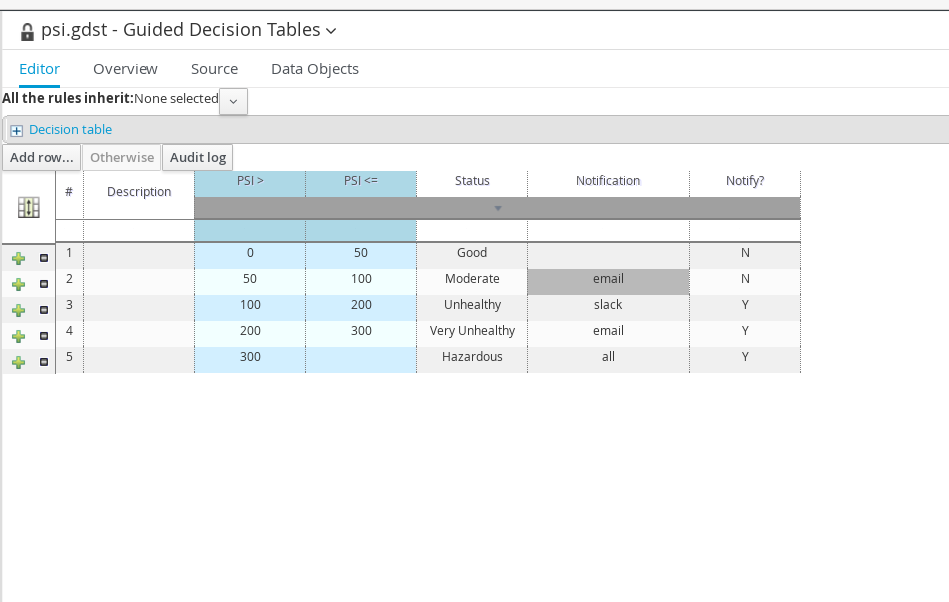
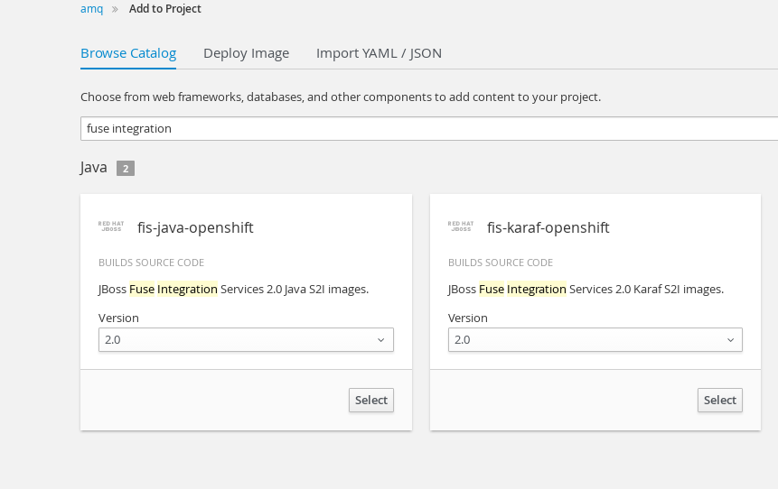
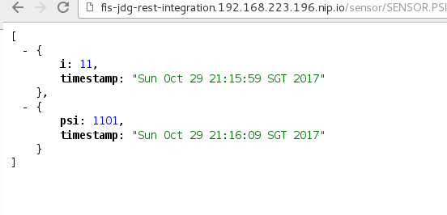
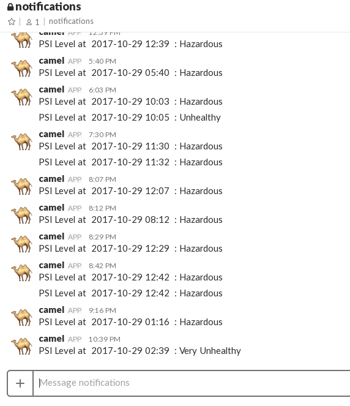

# Integration Demo on Openshift Container Platform

This demo showcases a integration demo using Fuse Integration Service, JBoss AMQ, JBoss BRMS and JBoss Datagrid components on Openshift container platform running a messaging workload.


### Pre-requisites
- A Openshift Container Platform that has the correct subscription entitlements to pull down Red Hat xPaaS images
- cluster-admin rights (for creating nodePorts)

Workstation with
- *oc* client installed
- Workstation running JBoss Developer Studio version 10 and java 8.

### Getting started

Create a new project call `integration`

    oc new-project integration

Create a new service account for the MQ images

    $ echo '{"kind": "ServiceAccount", "apiVersion": "v1", "metadata": {"name": "amq-service-account"}}' | oc create -f -

    $ oc policy add-role-to-user view system:serviceaccount:integration:amq-service-account


### Quick start

This section contains all the CLI components to deploy the various services, for the impatient

1. Create MQ broker (acting as sensors)

```
    oc new-app --template=amq63-basic -p MQ_USERNAME=admin -p MQ_PASSWORD=admin -p AMQ_STORAGE_USAGE_LIMIT=2gb -p IMAGE_STREAM_NAMESPACE=openshift -p MQ_PROTOCOL="openwire,mqtt,amqp" -p APPLICATION_NAME=mock-sensors
```

Create a nodePort pointing to port 1883 for this Pod (or refer to the detailed section below for [mock-sensors](#deploying-the-mock-sensors))   

2. Create MQ broker (for data layer)

```
    $ oc new-app --template=amq63-basic -p MQ_USERNAME=admin -p MQ_PASSWORD=password -p AMQ_STORAGE_USAGE_LIMIT=2gb -p  IMAGE_STREAM_NAMESPACE=openshift -p MQ_PROTOCOL="openwire,mqtt,amqp" -p APPLICATION_NAME=amq-broker
```

Create a nodePort pointing to port 1883 for this Pod (or refer to the detailed section below for [AMQ broker](#deploying-amq))

3. Deploy Datagrid

```
    $ oc new-app datagrid71-basic --name=jdg -p USERNAME=admin -p PASSWORD=admin -p ADMIN_GROUP=admin -p IMAGE_STREAM_NAMESPACE=openshift -p CACHE_NAMES=demoCache,testCache
```

4. Deploy BRMS Decision Server

```
    $ oc new-app --template=decisionserver64-basic-s2i  -p KIE_CONTAINER_DEPLOYMENT=psi=com.demo:demorules:1.0 -p KIE_SERVER_USER=kieserver -p KIE_SERVER_PASSWORD=jboss.1234 -p APPLICATION_NAME=kie-app -p SOURCE_REPOSITORY_URL=https://github.com/wohshon/demo-psi-rules -p SOURCE_REPOSITORY_REF=master -p CONTEXT_DIR=/demorules -p IMAGE_STREAM_NAMESPACE=openshift
```

5. Deploy FIS

```
    $ oc new-build --image-stream=fis-java-openshift --name=fis --binary=true

    $ oc start-build fis --from-dir=.

    $ oc new-app fis -e APP_PASSWORD=jboss.1234 -e APP_PROPERTY_FILE=props.properties

    $ oc expose dc fis --port=8082 --name=fis-jdg-rest

    $ oc expose svc fis-jdg-rest
```


### For more detailed setup instructions, please read on:

This Demo consist of these components:


1. [Deploying AMQ Broker component](#deploying-amq).

  This acts a messaging gateway to host messages received from external source (sensors) and exposed the data for subscribed clients.

2. [Deployng JBoss Datagrid](#deploying-jboss-datagrid)

  This is a in memory data cache to hold data received from external source. Data from the same source will be kept in an array and stored in the cache.
  The data is retrievable via REST API exposed by FIS.

3. [Deployng the mock sensors](#deploying-the-mock-sensors)

  An AMQ pod acting as sensors to host allow messages to be consumed

4. [Deployng the Decision Server (BRMS)](#deploying-the-decision-server)

    This is the business rule component, in this demo, it will send notifications to a real time messaging and smtp email upon detecting some conditions in the incoming data

5. [Deployng Fuse Integration Service](#deploying-fuse-integration-service)

  This is the integration component in the demo, it pulls messages from AMQ, do some basic filtering and route messages back to AMQ based on payload.


6. [Running the Client](#client)

  This is a sample mqtt client.

7. Others

   The demo uses a [slack webhook](https://api.slack.com/incoming-webhooks) and a mock smtp email endpoint (e.g [mailtrap.io](https://mailtrap.io)).  

### Deploying AMQ

For this demo, we will be using the sending messages to the AMQ instances on OCP via [nodePort](https://docs.openshift.com/container-platform/3.6/dev_guide/getting_traffic_into_cluster.html#using-nodeport).

If you wish to use the built-in router, please refer to the instructions  [here](https://github.com/wohshon/fis-demo#sending-messages-via-ocp-router).


**Deploy AMQ image**

-Via CLI

    oc new-app --template=amq63-basic -p MQ_USERNAME=admin -p MQ_PASSWORD=password -p AMQ_STORAGE_USAGE_LIMIT=2gb -p  IMAGE_STREAM_NAMESPACE=openshift -p MQ_PROTOCOL="openwire,mqtt,amqp" -p APPLICATION_NAME=amq-broker

Some Notes

- that the above command assumes you already have a working image stream / template setup in the openshift namespace.

- We are using the out-of-the-box amq image to keep things simple. To use a customized amq images, check out the demo here

  - [Using a custom authorization plugin and PropertyLoginPlugin](https://github.com/wohshon/custom-xpaas-amq)

  - [Using LDAP authentication and authorization to access MQ destinations](https://github.com/wohshon/custom-xpaas-amq/tree/iot)  


- Via Web Console


1. Click on `Add to Project` at the top banner of the web console.

2. On the service catalog page, search and select the image `amq63-basic`

4. Fill up the form and click on `create`

| # | Field                 | Value          | Remarks       |
|---| ----------------------|:--------------:|:-------------:|
| 1 |APPLICATION_NAME       | broker         |               |
| 2 |MQ_PROTOCOL            | openwire,mqtt  |               |
| 3 |MQ_TOPICS / MQ_QUEUES  | e.g. demo.topic   | Optional      |
| 4 |MQ_USERNAME            | admin          |               |
| 5 |MQ_PASSWORD            | password          |               |
| 6 |AMQ_MESH_DISCOVERY_TYPE| kube           |               |
| 8 |AMQ_STORAGE_USAGE_LIMIT| 1-2G           | 1-2G sufficient for demo use cases|
| 7 |IMAGE_STREAM_NAMESPACE | openshift      |   default      |


**Creating a nodePort**

1. Create a yaml file, save it under any name with a `.yml` extension :

    apiVersion: v1
     kind: Service
     metadata:
       name: mqtt-amq-broker-nodeport
       namespace: integration
       labels:
         application: amq-broker
     spec:
       ports:
         - name: port-1
           protocol: TCP
           port: 1883
           targetPort: 1883
           nodePort: 30005
       selector:
         application: amq-broker
       type: NodePort
       sessionAffinity: None

Ensure that the `selector` value is pointing to a valid label that can reference the AMQ POD. You can check the labels under the `deploymentConfig`


2. Create the nodePort service

    `oc create -f <file>.yml`


### Deploying JBoss Datagrid

- Via CLI

```
    oc new-app datagrid71-basic --name=jdg -p USERNAME=admin -p PASSWORD=admin -p ADMIN_GROUP=admin -p IMAGE_STREAM_NAMESPACE=openshift -p CACHE_NAMES=demoCache,testCache
```

We are using the version 7.1 imagestream which we pulled from the [jboss openshift github repo](https://github.com/jboss-openshift/application-templates)

If your environment is already configured with the JBoss middleware images, JDG version 7.0 will work, just adjust the above command accordingly to the correct imagestream or template name. But if you need to setup the images from scratch,

- import the imagestream and templates into `openshift` namespace as a cluster-admin. (instructions on the jboss openshift repo)

- in case after running the new-app command, the deployment config did not fire off a deployment, try the following command (adjust dc name accordingly):


    oc patch dc/datagrid-app --patch '{"spec":{"triggers": [{"imageChangeParams": {"automatic": true,"containerNames": ["datagrid-app"],"from": {"kind": "ImageStreamTag",           "name": "jboss-datagrid71-openshift:latest", "namespace": "openshift"}},"type": "ImageChange"},{"type": "ConfigChange"}]}}'

After the pod is running, check if the service datagrid-app-hodrod is running at port 11333:


    $ oc get service
    NAME                       CLUSTER-IP       EXTERNAL-IP   PORT(S)          AGE
    datagrid-app-hotrod        172.30.108.135   <none>        11333/TCP        6d


### Deploying the mock sensors

- via CLI

    $ oc new-app --template=amq63-basic -p MQ_USERNAME=admin -p MQ_PASSWORD=admin -p AMQ_STORAGE_USAGE_LIMIT=2gb -p  IMAGE_STREAM_NAMESPACE=openshift -p MQ_PROTOCOL="openwire,mqtt,amqp" -p APPLICATION_NAME=mock-sensors

- create a nodeport for this instance using the sample config below

    apiVersion: v1
      kind: Service
      metadata:
        name: mock-sensor-nodeport
        namespace: integration
        labels:
          application: mock-sensors
      spec:
        ports:
          - name: port-1
            protocol: TCP
            port: 1883
            targetPort: 1883
            nodePort: 30004
        selector:
          application: mock-sensors
        type: NodePort
        sessionAffinity: None


### Deploying The Decision Server

The BRMS project has been implemented on a BRMS design time environment and the project artifacts are hosted on github.
The business rules detect PSI level; and based on the level, decide whether to trigger notifications.
The rules were designed using a decision table, which allows end users to edit the business rules without knowing how to implement technical rules. In the demo, the rules designing are out of scope, however a demo to show continuous integration and deployment is possible.

e.g.:




To deploy the BRMS project into decision server, in the same project

    oc new-app --template=decisionserver64-basic-s2i  -p KIE_CONTAINER_DEPLOYMENT=psi=com.demo:demorules:1.0 -p KIE_SERVER_USER=kieserver -p KIE_SERVER_PASSWORD=jboss.1234 -p APPLICATION_NAME=kie-app -p SOURCE_REPOSITORY_URL=https://github.com/wohshon/demo-psi-rules -p SOURCE_REPOSITORY_REF=master -p CONTEXT_DIR=/demorules -p IMAGE_STREAM_NAMESPACE=openshift


### Deploying Fuse Integration Service

This should be the last component to deploy. If the endpoints that this service is connecting to is not up, it will throw an error. Error handling to be incorporated later.

more info on this image, [Fuse Integration Service](https://access.redhat.com/documentation/en-us/red_hat_jboss_fuse/6.3/html-single/fuse_integration_services_2.0_for_openshift/), consist of a camel workload running in a spring boot runtime.

The camel project is hosted on [github](https://github.com/wohshon/fis-integration)

The camel project is wired to the AMQ instances and datagrid instance deployed in the previous section.

**Important**

  1. Before deploying, please check the 'props.properties' file under 'src/main/resources'

  Note that there are some parameters defined for urls and hostnames, e.g.

      tcp://broker-amq-mqtt.integration.svc.cluster.local:1883

  These urls follow a convention of

      <service name>-<project/namespace name>.svc.cluster.local:<port of service>

  You should check they are consistent with your mock sensors, amq and jboss datagrid

  2. props.properties contains entries that looks like `ENC(.....)`, these are encrypted fields to cater for public hosting of this project.
  You can safely replace them with clear values when deploying in your own environment


3 ways to deployed the project

- via s2i (source)

1. Click on `Add to Project`, Search for `Fuse Integration` and select fis-java-openshift



2. Enter the name (e.g. fis) and `https://github.com/wohshon/fis-integration` under *Git Repository URL* and click Create.

3. Specify 2 environment variables

  - APP_PASSWORD=jboss.1234

  - APP_PROPERTY_FILE=props.properties

3. This will kick start the deployment of the FIS image

4. Expose a route and service at 8082

- via s2i (binary build)

    $ oc new-build --image-stream=fis-java-openshift --name=fis --binary=true
    $ oc start-build fis --from-dir=.
    $ oc new-app fis -e APP_PASSWORD=jboss.1234 -e APP_PROPERTY_FILE=props.properties
    $ oc expose dc fis --port=8082 --name=fis-jdg-rest
    $ oc expose svc fis-jdg-rest

- via CLI

Using `oc` command:

    $ oc new-app --name=fis --image-stream=fis-java-openshift https://github.com/wohshon/fis-integration#iot -e APP_PASSWORD=jboss.1234 -e APP_PROPERTY_FILE=props.properties

    $ oc expose dc fis --port=8082 --name=fis-jdg-rest
    # oc expose svc fis-jdg-rest

OR If you have maven configured correctly, you can use the deploy using the fabric8 plugin from a local git clone of this repo

1. Ensure you are login to OCP server, and in the correct namespace.

2. At the root of the camel project, run

  `$ mvn fabric8:deploy`

2. It will take a whle for the binary deployment to complete.


Finally, after deployment, expose the rest endpoint, this is for external clients to read the datagrid via REST.

    $ oc expose dc camel-ose-springboot-xml --port=8082 --name=fis-jdg-rest

    $ oc expose svc fis-jdg-rest

note down the route that is created

### Testing The Setup

There is a amqclient.jar in this repo, Use it to subscribe and send messages to mqtt topics

A quick word on this demo, it assumes there is a sensor call `sensor.psi.1` on the mock sensor.

Messages that to that topic will be routed to
- a outgoing AMQ instance (or the data access layer in the diagram) to a topic `SENSOR/PSI/1/DATA`
- Datagrid, a cache call demoCache, a key `SENSOR.PSI.1.DATA` holding a json array of the messages for that 'sensor'.


To test the setup,

Subscribe to the Outgoing topic at the data access layer **please specify your own url using the nodeport you created!**

    $ java -cp amqclient.jar com.demo.activemq.client.MQTTClient tcp://192.168.223.196:30005 admin password client123 SENSOR/PSI/1/DATA  "random text" 1

Open another terminal window:

To send a message to that mock sensor : **please specify your own url using the nodeport you created!**

    java amqclient.jar com.demo.activemq.client.MQTTClient tcp://192.168.223.196:30004 admin admin client123 sensor.psi.1  "{'psi':301,'timestamp':'$(date)'}" 0

Outcome:

1. You should see a message appearing in the first terminal window

2. access the url `http://<your route>/sensor/SENSOR.PSI.1.DATA`, you should see a json array of the message you sent

  

3. A message sent to the slack channel

  

4. An email sent to the mail box setup to received notifications

  

